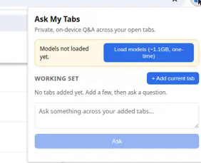

# Ask My Tabs

[](LICENSE)
[](https://github.com/inamdarmihir/ask-my-tabs/actions/workflows/build.yml)


**Your tabs, cross-examined. Every answer cites the page it came from.**

You have 30 tabs open. Three of them contain the answer. You do not remember which.

Ask My Tabs is a Chrome extension that turns the pages you are reading into a searchable knowledge
base. Add some tabs, ask a question in plain English, and an agent searches across all of them and
writes an answer with numbered citations. Hover a citation to see the exact excerpt. Click it to
jump to the page.

There is no Ask My Tabs server. The extension talks directly to a vector database and a language
model that you choose. Run both on your own machine and nothing leaves it.



## Contents

- [Before / after](#before--after)
- [What you get](#what-you-get)
- [Numbers](#numbers)
- [How it works](#how-it-works)
- [Install](#install)
- [Using it](#using-it)
- [Configuration](#configuration)
- [Privacy](#privacy)
- [Architecture](#architecture)
- [Development](#development)
- [FAQ](#faq)
- [Contributing](#contributing)

## Before / after

You ask: *"Which of these libraries supports streaming, and what did the maintainers say about
rate limits?"*

**A chatbot with no access to your tabs**

> Most popular libraries support streaming. Rate limits vary by provider, so check the docs.

No sources. No way to check it. It has not read the pages you are looking at.

**Ask My Tabs**

> The `acme-sdk` supports streaming through `client.stream()` [1], while `other-lib` only
> streams on the paid tier [2]. A maintainer said the default limit is 60 requests per minute and
> can be raised on request [3].

Each `[n]` is a chip. Hover it to read the snippet the claim rests on. Click it to open the tab.
If the model invents a citation number that points at nothing, the extension detects it and flags
it instead of showing it as fact.

## What you get

**Answers you can verify**

- **Cited answers.** Every claim is tagged `[1]`, `[2]` and mapped back to its source page.
  Out-of-range or invented citations are detected and flagged.
- **Citation previews.** Hover for the excerpt. Click to jump to the page card, check whether the
  page changed since you added it, or switch to the live tab.
- **Prompt-injection guard.** Page text reaches the model as untrusted data, with an explicit
  instruction not to follow anything inside it.

**An agent that actually researches**

- **Deep agent.** With OpenAI, Groq, or any OpenAI-compatible endpoint, a
  [deepagents](https://github.com/langchain-ai/deepagents) research agent on LangGraph plans with
  todos, lists your sources, runs hybrid searches, reads whole pages, and can hand sub-questions
  to a `researcher` subagent. Its citations are checked against the snippets its tools returned.
- **Fast pipeline.** The on-device model and Gemini use a fixed path: plan one to three queries,
  retrieve, check whether the snippets are enough (one refined follow-up search at most), answer.
  Comparative questions are split into per-topic queries. If the deep agent fails, the pipeline
  answers instead.
- **Read mode.** "Summarize this page" questions read the page in order within a character
  budget. Similarity search is the wrong tool for them: it returns arbitrary pieces.

**Retrieval that holds up**

- **Hybrid search in Qdrant.** Dense embeddings (`mdbr-leaf-ir`) and BM25 (stemmed, k1=1.2,
  b=0.75, IDF computed by Qdrant from live collection statistics) are fused with weighted
  Reciprocal Rank Fusion in a single Query API call. Dense-only and sparse-only modes are in
  Settings.
- **Source-diverse results.** Results are grouped by source, so one long page cannot crowd the
  other tabs out of an answer.
- **Structure-aware extraction.** Pages keep their line structure. Feeds such as Hacker News or
  Reddit are detected and chunked so each item stays with its points and stats.
- **Durable sources.** Pages are keyed by normalized URL, not Chrome's reusable `tabId`.
  Re-adding an unchanged page is a no-op. A changed page replaces its old snapshot.

**A UI that gets out of the way**

- **Guided setup with live progress.** A checklist walks through the database, the answer model
  and your first page. The model download and page indexing show real progress (percent, MB,
  stage) and keep going if you close the popup.
- **Pick exactly which tabs to add.** The current tab, specific open tabs you tick, or all of them.
- **Working set or library.** Query only the tabs you added, or everything you have ever indexed,
  filtered by domain or date.
- **Chat threads.** Up to 60 saved conversations that survive restarts and keep follow-up context,
  grouped by date and searchable.
- **Light, dark or system theme.**

**Your backends, your call**

- **Vector storage:** local Qdrant in Docker, or Qdrant Cloud.
- **Language model:** on-device (WebLLM), OpenAI, Groq, Gemini, or a custom OpenAI-compatible base
  URL (Azure, Ollama, LM Studio, a proxy).
- **Embeddings** always run in your browser.

## Numbers

Measured with `npm run eval` on BEIR SciFact: 300 queries over a 1000-document corpus, using the
extension's own chunking, BM25 and Qdrant query code. Full method in
[`eval/RESULTS.md`](eval/RESULTS.md).

| Metric | Value |
| --- | --- |
| nDCG@10, hybrid (dense + BM25) | **0.842** |
| nDCG@10, dense only | 0.835 |
| nDCG@10, BM25 only | 0.795 |
| Recall@10, hybrid | 0.925 |
| MRR@10, hybrid | 0.819 |
| Bundled embedding model | 23 MB (`leaf-ir`, q8), works offline |
| Embedding speed (Node, Apple M2) | 16 ms per chunk, 2 ms per query |
| Qdrant query time | about 2 ms |
| Servers run by this project | 0 |
| Analytics and telemetry | none |

Two honest notes. Hybrid beats dense-only on SciFact, but only by about 0.007 nDCG, so on
scientific abstracts most of the quality comes from the embedder. SciFact is also not web pages;
we have not yet measured retrieval on real browsing content. We picked the embedder by a written
rule (best hybrid nDCG within a size budget), recorded in [`DECISIONS.md`](DECISIONS.md), which
chose `leaf-ir-q8` over three larger candidates.

## How it works

1. **Add tabs.** The extension reads the page text, keeping its structure.
2. **Index.** Text is split into overlapping chunks of about 180 words. Each chunk is embedded in
   the browser by the bundled model and upserted to Qdrant as a dense vector plus a BM25 sparse
   vector. Point IDs are hashes of the source key and chunk index, so re-adding a page is
   idempotent.
3. **Ask.** The agent plans queries, runs hybrid search (dense and sparse prefetches, weighted
   RRF, grouped by source), and checks whether the evidence covers the question.
4. **Answer.** The model writes the answer from numbered snippets. Citations are validated against
   the snippets that were actually retrieved before they are shown.

Two answering paths, chosen in [`src/offscreen.js`](src/offscreen.js):

| | Deep agent | Pipeline |
| --- | --- | --- |
| Code | [`src/lib/deep-agent.js`](src/lib/deep-agent.js) | [`src/lib/agent.js`](src/lib/agent.js) |
| Used when | Agent mode is `deep` and the provider is OpenAI-compatible with a key | Everything else, and as the fallback |
| Tools | `list_sources`, `search_pages`, `read_page`, planning, `researcher` subagent | Fixed: plan, search, sufficiency check, answer |
| Hops | Open-ended, bounded by a recursion limit and a 150 s timeout | At most two |
| Citations | Renumbered from a shared registry, kept only if they resolve to a real snippet | Validated against retrieved snippets |

## Install

`dist/` is committed pre-built, so you can load the extension without installing Node.

1. Start a vector database. The simplest option is local Qdrant:

   ```bash
   docker compose up -d
   ```

   Or skip this and use a [Qdrant Cloud](https://cloud.qdrant.io) cluster (see
   [Configuration](#configuration)).
2. Open `chrome://extensions` and enable **Developer mode**.
3. Click **Load unpacked** and select this repository folder (the one containing `manifest.json`).
4. Follow the setup checklist, or open **Settings** from the popup's **...** menu.

Requirements: a Chromium browser. The on-device language model also needs WebGPU (Chrome 113+ or
an equivalent Edge build). Hosted language models do not.

## Using it

1. Open a few pages.
2. Open the popup and choose **Pages**. Add the current tab, tick specific tabs, or add them all.
3. Switch to **Chat** and ask.
4. Use the scope switch to search only your working set, or your whole library.
5. Open the history button to return to earlier threads.

Questions that work well: comparisons across pages ("how do these two docs differ on
authentication?"), lookups ("what version introduced this flag?"), and summaries ("summarize this
page").

## Configuration

All settings live in the extension's Settings page and are stored in `chrome.storage.local`.

### Vector storage

| Option | Setup | Notes |
| --- | --- | --- |
| **Local Qdrant** (default) | `docker compose up -d`, URL `http://127.0.0.1:6333` | Qdrant v1.19.1, bound to `127.0.0.1` only. Pinned by tag and digest; supports `amd64` and `arm64`. |
| **Qdrant Cloud** | Enter your cluster URL and API key, then click **Test Connection** | Requires Qdrant v1.17 or later. Chunk text, URLs, and titles are stored in your cluster. |

### Language model

| Provider | Default model | Requirements |
| --- | --- | --- |
| **On-device (WebLLM)** (default) | `Qwen3-0.6B-q4f16_1-MLC` (thinking disabled) | WebGPU, about 0.5 GB one-time download |
| OpenAI | `gpt-6-luna` | API key |
| Groq | `llama-3.3-70b-versatile` | API key |
| Google Gemini | `gemini-1.5-flash` | API key |

The model field accepts any model the provider supports. **Test key** checks the key and model
without spending tokens.

### Retrieval and agent mode

| Setting | Values | Default |
| --- | --- | --- |
| Retrieval mode | `hybrid` (dense + BM25, RRF), `dense`, `sparse` | `hybrid` |
| Agent mode | `deep` (research agent), `pipeline` (fixed path) | `deep` |

The deep agent runs only with OpenAI-compatible providers and an API key. WebLLM and Gemini always
use the pipeline.

## Privacy

What leaves your machine depends on the backends you choose:

| Data | Local Qdrant + on-device model | Qdrant Cloud | Hosted LLM API |
| --- | --- | --- | --- |
| Page text, URLs, titles | Stays on your machine | Sent to your Qdrant cluster | Retrieved snippets are sent with each question |
| Your questions | Stay on your machine | Stay on your machine | Sent to the provider |
| API keys | Stored in `chrome.storage.local` | Stored in `chrome.storage.local` | Stored in `chrome.storage.local` |

- The extension has no analytics or telemetry, and the project runs no servers.
- The embedding model ships inside the extension. Only the optional on-device language model is
  downloaded (from the WebLLM model CDN, on first use), and that request does not include your data.
- Local Qdrant is reachable by any software running as your user. Do not index sensitive pages on
  a shared machine.
- See [`privacy-policy.html`](privacy-policy.html) and [`store/permissions.md`](store/permissions.md)
  for the full policy and a justification of each permission.

## Architecture

Models and the agent loop live in a Chrome
[offscreen document](https://developer.chrome.com/docs/extensions/reference/api/offscreen), which
outlives the popup and, unlike an MV3 service worker, has reliable DOM and WebGPU access.
`background.js` is a thin router that reads tab content and creates the offscreen document.

```
popup / settings / onboarding  <->  background (service worker)  <->  offscreen document
                                                                        ├─ embeddings (transformers.js)
                                                                        ├─ LLM (WebLLM or provider API)
                                                                        └─ deep agent / pipeline -> Qdrant
```

Design rationale and verified behaviors are in [`DECISIONS.md`](DECISIONS.md).

<details>
<summary>Project layout</summary>

```
manifest.json            Extension manifest (MV3)
popup.html / settings.html / onboarding.html    Page shells; the UI is React (src/)
offscreen.html           Hosts the models and agent loop
privacy-policy.html      Privacy policy page
src/
  background.js          Service worker: tab access, offscreen lifecycle
  offscreen.js           Embedder, LLM, and agent host (chooses deep agent or pipeline)
  popup/                 Popup: chat, pages, library, history, setup checklist
  settings/, onboarding/ Settings page and first-run wizard
  ui/                    Shared UI: Tailwind v4 theme (styles.css), Radix-based components, hooks
  lib/
    deep-agent.js        deepagents/LangGraph research agent, tools, citation registry
    agent.js             Fixed pipeline: multi-hop retrieval and answer generation
    reading.js           Read mode: ordered page reading for summaries, chat history
    threads.js           Chat thread storage helpers
    repetition.js        Detects and trims looping small-model output
    timing.js            Stage timer for indexing and answer diagnostics
    qdrant.js            Qdrant REST adapter (collections, upsert, hybrid query)
    library.js           Indexing, snapshot replacement, source management
    embeddings.js        Dense embedding model wrapper (loads the bundled model)
    embedding-model.js   The one place that names the embedding model
    sparse.js            BM25 sparse vectors (stemmed, hashed, Qdrant-side IDF)
    llm.js               On-device WebLLM wrapper
    llm-api.js           OpenAI-compatible and Gemini clients
    config.js            Settings schema and storage
    chunk.js             Word and structure-aware chunking
    ids.js, filters.js, freshness.js, gpu.js, constants.js
models/                  Bundled embedding model (see scripts/fetch-models.js)
eval/                    Retrieval eval harness and results
scripts/                 Developer scripts
tests/                   unit, integration, and e2e tests
store/                   Chrome Web Store listing and permission justifications
docker-compose.yml       Local Qdrant
dist/                    Pre-built bundles
```

</details>

## Development

Requires Node.js 18+ and npm.

```bash
npm install                # install dependencies
npm run build              # bundle src/ into dist/
npm run watch              # rebuild on change
npm test                   # unit tests (no services required)
npm run test:integration   # integration tests against live Qdrant (docker compose up -d)
npm run eval               # retrieval eval on BEIR SciFact; needs Qdrant, writes eval/RESULTS.md
```

After rebuilding, reload the extension from `chrome://extensions`. Chrome does not watch `dist/`.
The build compiles Tailwind CSS (`src/ui/styles.css` to `dist/ui.css`) and bundles the React pages
with esbuild.

## FAQ

**Does anything leave my machine?**
Not with local Qdrant and the on-device model. With a hosted model, the retrieved snippets and
your question go to that provider. With Qdrant Cloud, page text goes to your cluster. See
[Privacy](#privacy).

**Why do I need Docker?**
For local Qdrant. If you would rather not run it, point the extension at a Qdrant Cloud cluster.

**Why is the on-device model's answer weaker than ChatGPT's?**
It is Qwen3-0.6B, chosen because it downloads in about 0.5 GB and runs in a browser. Retrieval and
citations are the same; the writing is simpler. Use a hosted model for better synthesis, and for
the deep agent.

**Will it work on my phone?**
No. Chrome on iOS, iPadOS and Android does not support extensions. Chrome and Edge on Windows and
macOS are supported. Linux and ChromeOS are expected to work but are not regularly tested.

**The on-device model will not start.**
It needs a working WebGPU adapter, which depends on your GPU, drivers and any organization policy.
The popup explains how to check `chrome://gpu`, or you can switch to a hosted provider. The
embedder runs on WASM and never needs a GPU.

**A page extracted badly.**
Extraction strips scripts and page chrome but is not Readability-grade. Client-rendered sites,
paywalled pages and content behind interaction may extract poorly.

**I navigated a tab after adding it. Is it updated?**
No. Remove and re-add the tab to refresh. The library keeps only the latest snapshot of each source.

**I used an older version. Is my data still there?**
No. Upgrading from the earlier IndexedDB-only version does not migrate existing data.

**Is the retrieval any good?**
On scientific abstracts, yes: see [Numbers](#numbers). It has not been measured on general web
content yet.

## Contributing

Issues and pull requests are welcome. Run `npm test` and `npm run build` before opening a PR, and
commit rebuilt `dist/` bundles when you change `src/`. A screenshot or GIF of an answered question
would be a valuable contribution.

## License

[MIT](LICENSE)
